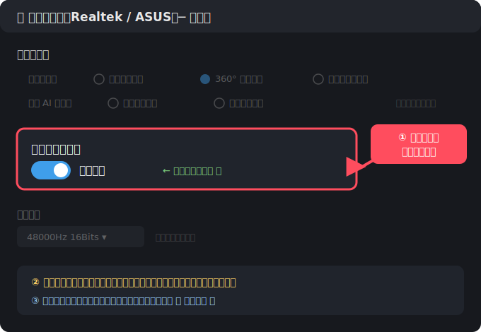

# 💌 匿名情人節告白信牆

把說不出口的那句喜歡，悄悄留在這裡。
完全匿名，沒有人知道是你 💕

👉 **網址**：https://qoqstor.github.io/Valentines_2608/

---

## 這是什麼？

一個匿名告白信牆。你可以：

- ✍️ 寫下想對某個人說的話
- 🎤 或直接用說的，錄一段語音告白（AI 幫你轉成文字，**聲音還會自動變聲**保護身分）
- 🐾 系統會給你一個可愛的動物代號，沒有人知道你是誰
- 💭 逛逛別人的告白，猜猜是誰寫的

---

## 怎麼用？

### 📝 寫一封文字告白

1. 點畫面中央的信封 💌 → 選「文字告白」
2. （選填）填上想告白的對象，例如「三班的她」
3. 寫下你的告白內容 → 按「投稿」

### 🎤 錄一段語音告白

1. 點信封 💌 → 選「語音告白」
2. （選填）填上告白對象
3. 按「開始錄音」說出你想說的話（最長 **20 秒**）——錄音時看得到即時音量條，確認有收到聲音
4. 按「停止」，稍等幾秒 AI 會把你的話轉成文字
5. **辨識結果可以直接點擊修改**！錯字改一改；就算辨識失敗，也可以自己打字補上
6. 確認後按「確認,送出投稿」

> 🎭 **變聲保護**：你的語音在播放時會自動隨機變聲（只變音調、不變速度），別人聽不出是你的聲音。
> 💡 錄音時盡量在安靜的地方、清楚地說，辨識會更準。

### 💻 筆電用戶必看：錄音前先關閉「麥克風音效」

部分筆電（尤其 ASUS / 使用 Realtek 音效的機種）內建的麥克風「智慧音效」會干擾錄音，造成**開頭大聲、後面悶掉或只剩雜音**。錄音前請先做一次以下設定（只需設定一次）：

1. 開啟 **Realtek Audio Console / MyASUS 音效主控台**（開始選單搜尋「Realtek」或「音效主控台」）
2. 進入 **麥克風** 頁面，找到 **「關閉麥克風音效」** 的開關，切成 **開啟（原始音訊）**
3. **完全關閉瀏覽器再重開**，回到網站錄一段測試

找不到上面的面板？改走 Windows 內建路徑：
工作列喇叭右鍵 → **音效設定** → **更多音效設定** → **錄製** → 麥克風 → **內容** → **增強功能** → 勾選 **停用所有音效** → 確定。

> 錄音時如果畫面出現「⚠️收音品質過差」的提示，就代表這個設定還沒生效，請再檢查一次。

### 📮 逛逛所有投稿

- 底部**跑馬燈**會滾動顯示所有告白，點任一則直接開信
- 點信封下方的「**目前已有 X 封投稿信**」會打開**完整投稿清單**，每一封都能點開

### 💭 猜猜這是誰寫的

點開任何一封告白，在「猜猜這是誰寫的？」輸入名字送出。
**每封信每個人只能猜一次喔！**

---

## 常見問題

**Q：別人會知道是我寫的嗎？**
完全不會。文字只顯示動物代號；語音還會**自動變聲**，連聲音都認不出來。

**Q：為什麼播放語音時聲音怪怪的？**
那是變聲保護在運作 🎭 音調會隨機變高或變低（速度不變），這是刻意設計來保護投稿者身分的。

**Q：辨識出來的文字有錯字怎麼辦？**
送出前直接**點擊文字框修改**就好！辨識完全失敗也可以自己打字輸入。

**Q：筆電錄音破音、悶悶的、或只有雜音？**
請看上面「💻 筆電用戶必看」，把麥克風音效關閉（原始音訊）再重開瀏覽器，多數情況就會恢復正常。

**Q：播放語音時背景音樂會吵到嗎？**
不會，播放語音時背景音樂會**自動暫停**，播完自動恢復 🎵

**Q：我可以投稿幾封？**
想投幾封都可以，盡情表白 💕

**Q：手機和電腦都能用嗎？需要下載或註冊嗎？**
瀏覽器打開網址就能用，不用下載 App、不用註冊登入。

**Q：右上角的「音樂」是什麼？**
點一下播放背景音樂，讓氣氛更浪漫 🎵 再點一下靜音。

---

## 小提醒

- 網站上方有個倒數計時 ⏳，數到 **8/19（七夕）** 那天
- 告白請溫柔而真誠，這是一個充滿善意的地方 🌸

---

💗 願每一句藏在心裡的話，都有勇氣說出口。
